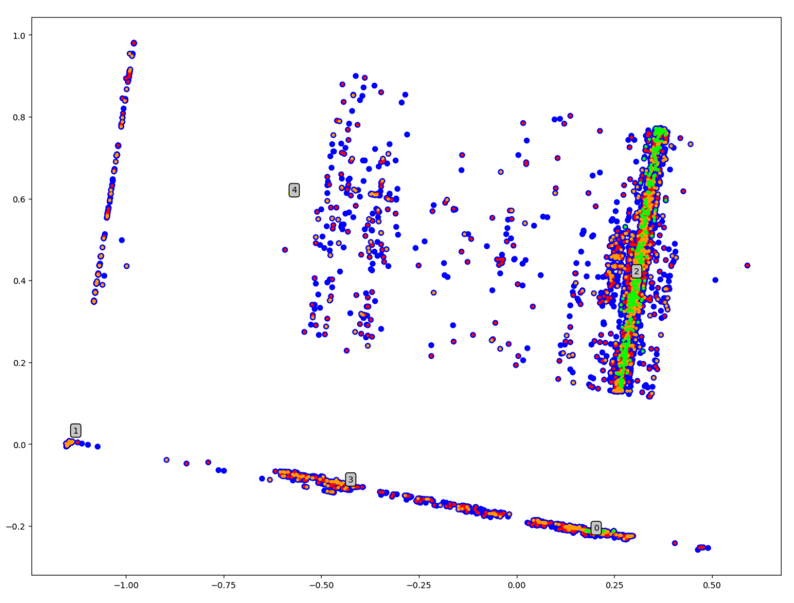
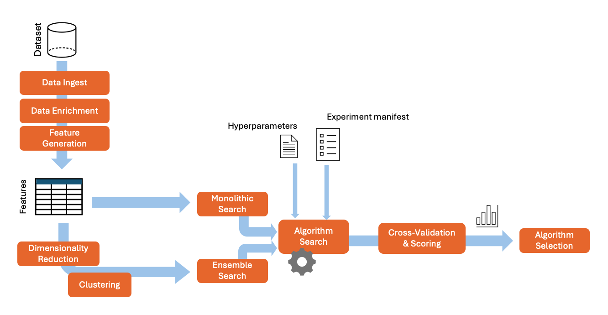

# Kaggle Classifier Competition 

**Goal**: Predict orchestra subscriptions based on historical data.

**Evaluation Criteria**: Predictions for a test set of predictors

## Approach

The approach to the prediction task is outline  below.

1. Conduct **exploratory data analysis** 
2. Establish a performance **baseline**
3. **Engineer features**
4. Develop an **automated data pipeline**
5. Build a scaffolding for **algorithm and hyperparameter search**
6. **Iteratively refine** features and algorithm evaluation until clear candidates emerged

Each logical phase is described in more detail below. 

## Exploratory Data Analysis

To gain an appreciation for the information in the dataset, exploratory data analysis was conducted on the provided tables. This was conducted exclusively within a Jupyter Lab context to enable rapid experimentation and evaluation of results. 

**Tributary Tables** 

For each table furnished, data was: 
1. Ingested and normalized, repairing encodings where necessary, avoiding imputation of data to prevent introduction of bias
2. Cleaned to remove spurious values
3. Transformed, wherever possible preserving the original values and their relation to other tables in the dataset
4. Encoded to enable statistical analysis, notably by 
     - homogenizing numerical representations 
     - ordinal encoding of features where a relative ordering or distance carried intrinsic meaning 
     - one-hot encoding of categoricals 

**Unified Data Model**

Upon completion of baseline analysis of the individual data tables, a macro-level analysis was conducted and a unified data model was constructed. This provided clarity on the relation of different features to one-another, the associated cardinality, the potential for quick and useful join operations and the relative prioritization of feature importance. 

**Underlying Distributions** 

Inspecting the underlying distributions of the data was aided through dimensionality reduction techniques, primarily principle component analysis (PCA). 

Armed with an understanding of some of the characteristics of the distribution, clustering algorithms were applied to yield further insights on the nature and composition of the low-dimensional clusters. These insights were the primary motivator for later ensemble  methods. Shown below is a 2d representation of the dataset, with 5 clusters labeled. Points are color coded to indicate true/false positives and negatives for a random forest classifier used later on in the model development.

- 

## Establish Performance Baselines 

To validate the worklfows developed during the EDA phase, the following classifiers were fit to the unenriched data:

- **Majority classifier** : simply emits the most represented class seen in training for any prediction
- **Random classifer** : emits a random class
- **Basic logistic regression** : fits a linear model with no transformations, or penalties 

These models were evaluated with the receiver operating characteristics (ROC) plot and the area under the ROC curve (AUROC). Baselining here both served as a canary to validate feature engineering activities and a reference point to measure performance going forward.

## Feature Engineering 

The feature engineering stage marked the beginning of an iterative process that involved developing insights and manifesting those insights as new feature columns in tributary tables, or features that had a clear relation to the prediction task.

Features were identified, promoted, refactored and jettisoned by a combination of methods, including: 
- correlation matrices (and heatmapping of) 
- confusion matrices and plots highlighting false positive/negative patterns 
- dimenstionality reduction through principle component analysis
- clustering by way of the k-means and DBSCAN algorithms
- numerical feature summing and scaling 
- intuition-based heuristics, such as relevance of composer and performer names to customer interest

Promising results from early random forest classifiers on the accounts table led to the decision to rally around a single account dataframe. Relevant data from other tables were subsequently summarized, joined and mutated based on their ability to improve the AUROC metric in the experimentation framework (described below). 

## Data Pipeline

Despite the relatively simple task assigned, the search space is quite daunting. To support experimentation on various features and associated algorithms, an automated pipeline was developed in Python. This is encapsulated within the accompanying `classy.py` application. The application's logical flow is documented here. 



## Algorithm and Hyperparameter Search

To aid in exploring the myriad different paths to improving model accuracy, an automated framework was developed which: 
- provided a clear syntax to define and iterate on discrete experiments via sci-kit learn pipelines
- enabled hyperparameter tuning through grid search
- applied cross validation to select candidate experiments
- visualized performance

When provided with raw data, algorithms and associated hyperparamter constraints, the framework will automatically nominate a winning algorithm for submission.

**Experiment Scaffolding**

An example experiment declaration follows. The statically defined scikit-learn pipelines created a homogenous environment to retrieve, retrain and visualize performance of the associated experiment.  

```
# Hyperparameter search ranges
lr_hparams = { 'penalty' : ('l1', 'l2'), 'C' : [x / 10 for x in range(1,4)]}
rf_hparams = { 'min_samples_leaf' : range(3,5,1), 'n_estimators': range(40,50,5), 'max_depth': range(7,9,1)}
sv_hparams = { 'C' : [x / 10 for x in range(1,5,2)], 'kernel' : ['sigmoid', 'rbf'] }
kn_hparams = { 'n_neighbors' : range(7,9)}

# Experiment defitions 
experiments = [

    # Control
    Pipeline([('model', DummyClassifier())]),

    Pipeline([('scaler', StandardScaler()), ('poly', PolynomialFeatures()), ('grid', GridSearchCV(SVC(), sv_hparams, error_score=0))]),
    Pipeline([('scaler', StandardScaler()), ('pca', PCA(n_components=12)), ('grid', GridSearchCV(SVC(), sv_hparams, error_score=0))]),

    Pipeline([('scaler', StandardScaler()), ('poly', PolynomialFeatures()), ('grid', GridSearchCV(KNeighborsClassifier(), kn_hparams, error_score=0))]), 
    
    # Logistic Regression w/ L1/L2 norm penalties         
    Pipeline([('grid', GridSearchCV(LogisticRegression(),lr_hparams, scoring='roc_auc', error_score=0))]),

    # Random forest         
    Pipeline([('grid', GridSearchCV(RandomForestClassifier(),rf_hparams, scoring='roc_auc', error_score=0))]),
    
    # PCA + LR
    Pipeline([('scaler', StandardScaler()), ('pca3', PCA(n_components=12)), ('model', SVC(kernel='rbf'))]),
    
    ...
```

**Command-line Interface**

A command-line interface (CLI) simplifies the repeated running of experiments and scripting of different inputs. The CLI implemented is shown below. 

```
usage: classy.py [-h] [-s | --search | -c | --clustersearch ] [-k SPLITS] [-v | --visualize ] [-g | --generate ]

options:
  -h, --help            show this help message and exit
  -s, --search, --no-search
  -c, --clustersearch, --no-clustersearch
  -k SPLITS, --splits SPLITS
  -v, --visualize, --no-visualize
  -g, --generate, --no-generate
```

## Ensemble Search 

The automated framework described above (see diagram) also operates in an ensemble search mode where configurable clusters of low-dimensional views on the data can each have a separate algorithm nominated and selected for the final submission.